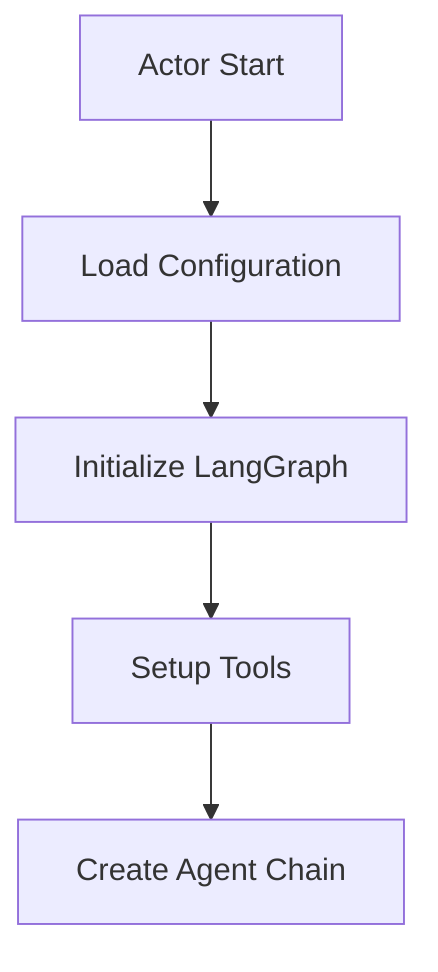
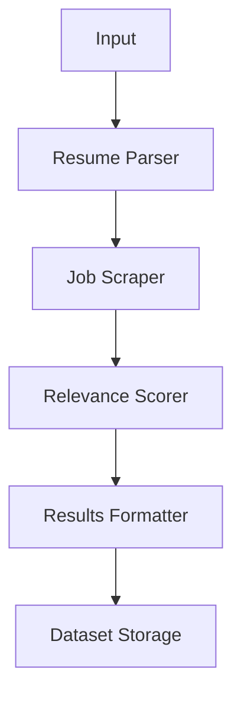

I'll outline a project structure for converting the job search system into an Apify actor using the LangGraph template. Based on the provided templates, the LangGraph template would be more suitable since our system already uses LangChain and similar patterns.

### Project Structure
```
job-search-actor/
├── .actor/
│   ├── actor.json          # Actor configuration and input schema
│   └── Dockerfile         # Docker configuration
├── src/
│   ├── __init__.py
│   ├── main.py            # Main actor entry point
│   ├── tools.py           # Job search tools definitions
│   ├── agents/
│   │   ├── __init__.py
│   │   ├── resume_parser.py
│   │   ├── job_scraper.py
│   │   └── scorer.py
│   ├── utils/
│   │   ├── __init__.py
│   │   ├── text_processor.py
│   │   └── data_cleaner.py
│   └── config/
│       ├── __init__.py
│       └── constants.py
├── README.md
└── requirements.txt
```

### Input Schema (actor.json)
```json
{
    "title": "Job Search Agent",
    "type": "object",
    "schemaVersion": 1,
    "properties": {
        "resumeText": {
            "title": "Resume Text",
            "type": "string",
            "description": "The full text of the resume",
            "editor": "textarea"
        },
        "searchPreferences": {
            "title": "Search Preferences",
            "type": "object",
            "properties": {
                "location": {
                    "title": "Location",
                    "type": "string",
                    "description": "Preferred job location"
                },
                "workMode": {
                    "title": "Work Mode",
                    "type": "string",
                    "enum": ["remote", "hybrid", "onsite", "any"],
                    "default": "any"
                },
                "maxResults": {
                    "title": "Maximum Results",
                    "type": "integer",
                    "default": 10
                }
            }
        }
    },
    "required": ["resumeText"]
}
```

### Workflow Logic

1. **Actor Initialization**


2. **Processing Flow**


3. **Data Flow**
```
Input -> Actor
  ├─> Resume Processing
  │   └─> Extracted Skills/Experience
  ├─> Job Search
  │   └─> Raw Job Listings
  ├─> Scoring/Matching
  │   └─> Ranked Results
  └─> Output Storage
      ├─> Dataset (Structured Data)
      └─> Key-Value Store (Full Results)
```

### Key Components

1. **Tools Integration**
```python
# tools.py structure
TOOLS = {
    'linkedin_search': ApifyActorsTool(...),
    'indeed_search': ApifyActorsTool(...),
    'resume_parser': ResumeParserTool(...),
    'relevance_scorer': ScoringTool(...)
}
```

2. **Agent Configuration**
```python
# Main agent setup
AGENT_PROMPT = """
You are a job search assistant that:
1. Analyzes resumes for key qualifications
2. Searches multiple job platforms
3. Scores and ranks matches
4. Provides detailed match explanations
"""
```

3. **Output Format**
```python
OUTPUT_STRUCTURE = {
    'matches': List[Dict],
    'statistics': Dict,
    'recommendations': List[str],
    'metadata': Dict
}
```

### Integration Points

1. **Apify Platform**
- Use Actor storage for results
- Leverage Actor webhooks for notifications
- Use proxy integration for job searches

2. **LangGraph Components**
- ReAct agent for decision making
- Tool selection and execution
- State management

3. **External Services**
- LinkedIn API via Apify actors
- Indeed API via Apify actors
- OpenAI API for analysis

### Deployment Considerations

1. **Resource Requirements**
```yaml
memory: 2048
timeout: 300
```

2. **Environment Variables**
```
OPENAI_API_KEY
APIFY_API_TOKEN
ACTOR_MEMORY_MBYTES
```

3. **Performance Optimizations**
- Concurrent job searches
- Batch processing
- Result caching

### Migration Steps

1. **Initial Setup**
- Clone LangGraph template
- Copy existing logic
- Update dependencies

2. **Code Adaptation**
- Convert functions to actor format
- Implement storage patterns
- Add error handling

3. **Testing**
- Local actor testing
- Integration testing
- Performance testing


